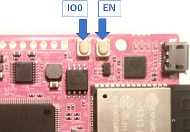

# GR-Boards_WebCamera
GR-PEACH、および、GR-LYCHEEで動作するサンプルプログラムです。  
GR-LYCHEEの開発環境については、[GR-LYCHEE用オフライン開発環境の手順](https://developer.mbed.org/users/dkato/notebook/offline-development-lychee-langja/)を参照ください。


## 概要
Webカメラのサンプルです。Webブラウザからアクセスすると以下が表示されます。  

* Camera入力画像
* I2Cバスに繋がっているデバイスの制御画面
* LED操作画面

## [事前準備] ESP32をATコマンド用のファームウェアに書き換える
本サンプルプログラムを使用する際はESP32をATコマンド用のファームウェアに書き換える必要があります。  
ここでは、``GR-LYCHEE_ESP32_Serial_Bridge``と``Windows PC版 Flash Download Tools V3.4.4``を使った書き込み方法を紹介します。  

まずはプロジェクト内`docs\esp32-at_bin.zip`を展開し、``GR-LYCHEE_ESP32_Serial_Bridge.bin``をGR-LYCHEEに書き込んでください。  

### シリアルドライバ
``GR-LYCHEE_ESP32_Serial_Bridge``はGR-LYCHEEのUSB0ポートをPCと接続して使用します。  

  

Windows10以外ご使用の場合、ドライバのインストールが必要となります。下記サイトの「Driver required on Windows!」からドライバーをダウンロードできます。  

https://developer.mbed.org/handbook/USBSerial

但し、「署名なしドライバ」となっていますので、お使いのWindowsバージョンによってはそのままインストールすることはできません。お使いのPC毎に設定方法が異なるため、検索サイトで「署名なしドライバ」で検索してください。  


### ESP32のFlash書き込み
Flash Download Toolsを下記からダウンロードしてください。  

Espressif’s official Flash Download Tools:  
http://espressif.com/en/support/download/other-tools?keys=&field_type_tid%5B%5D=13

`flash_download_tools_v3.4.4.zip`を展開し、`ESPFlashDownloadTool_v3.4.4.exe`を実行します。  

  
*ESP32 DownloadTool* を選択します。  

  

1. `docs\esp32-at_bin.zip`内の書き込み用の.binファイルを設定します。  
  bootloader.bin(0x1000)、partitions_at.bin(0x8000)、phy_init_data.bin(0xF000)、esp-at.bin(0x10000)を設定してください。左のチェックボックスにも忘れずにチェックを入れてください。  

2. SPI SPEEDに*40MHz*を設定します。  

3. SPI MODEに*DIO*を設定します。  

4. FLASH SIZEに*32Mbit*を設定します。  

5. COMにUSB0に割り当たったCOMポートを設定します。  

6. ボーレートを選択します。460800bpsでの書き込みを確認できていますが、書き込みに失敗するようでしたらボーレートを下げてください。

7. ESP32を書き込みモードにするため、GR-LYCHEEの **US1(IO0)** を押しながら **US0(EN)** を短押し、その後 **US1(IO0)** を離します。ターミナルソフトソフトで該当のCOMポートを開いている場合は、ターミナルソフトを終了させ、COMポートを開放してください。最後にツールのSTARTボタンを押すと書き込みを開始します。  
  


## 使い方
1. GR-Boardに電源を入れ、Terminalソフトを立ち上げます。  
  PCとの接続は mbed I/F側を使用(USB0じゃない方)を使用してください。

2. GR-Boardのリセットボタンを押すと、Terminal上にWifiのスキャン結果が出力されます。  
  Terminaｌの使い方は以下のリンクを参照下さい。  
  mbedでのボーレートのデフォルト値は9600で、このサンプルではボーレート9600を使います。  
  https://developer.mbed.org/teams/Renesas/wiki/GR-PEACH-Getting-Started#install-the-usb-serial-communication  
  https://developer.mbed.org/handbook/SerialPC  

  ```
  ********* PROGRAM START ***********
  Network Setting up...
  Scan:
  No.0 Network: SSID_1 secured: WPA/WPA2 BSSID: xx:xx:xx:xx:xx:xx RSSI: -52 Ch: 1
  No.1 Network: SSID_2 secured: Unknown BSSID: xx:xx:xx:xx:xx:xx RSSI: -67 Ch: 2
  2 networks available.

  Please enter the number of the network you want to connect.
  Enter key:[0]-[1], (If inputting the other key, it's scanned again.)
  ```

  接続したいネットワークの番号をキーボードから入力します。  
  0番のSSID_1を選択する場合はキーボードの "0" を押します。  

  ```
  [SSID_1] is selected.
  please enter the PSK.
  ```

  最後にネットワークに接続するためのパスワードを入力します。    

3. 接続に成功すると、Terminal上にIPアドレスが出力されます。  
  ```
  connecting...
  MAC Address is xx:xx:xx:xx:xx:xx
  IP Address is 192.168.0.2
  NetMask is 255.255.255.240
  Gateway Address is 192.168.0.1
  Network Setup OK
  ```

4. PCのWebブラウザで Terminalに表示された **IP Address** (上記例では 192.168.0.2)を開くと、トップ画面が表示されます。  
  トップ画面は、左側にメニュー画面、右側にサンプルプログラムの説明画面という構成になっており、左画面の各メニューをクリックすると、メニューに沿った画面が右画面に表示されます。

5. メニュー画面の”Web Camera”をクリックすると、Camera画像が表示されます。  
  "Wait time"のスライダーバーでCamera画像の更新タイミングが変更できます。(初期値は500msです)

6. メニュー画面の"Setting by I2C"をクリックすると、I2Cバスに繋がっているデバイスの制御画面が表示されます。  
  直接入力(Direct input)欄又はファイル参照(File reference)欄にて、下記("I2Cによるデバイス設定のフォーマット")に記載されているフォーマットのコマンドを送信する事で、I2CのI2C_SDA,I2C_SCL端子に繋がっているデバイスに対して、データの送受信が可能です。  
  "I2Cによるデバイス設定のフォーマット"による送受信の通信ログは、ログウィンドウに表示されます。  
  "Clear"ボタンを押すとログのクリア、"Save"ボタンを押すとログの保存ができます。  

7. メニュー画面の"LED On/Off"をクリックすると、LED操作画面が表示されます。  
  各スイッチはGR-BoardのLED ON/OFFを切り替えます。  
  スイッチはそれぞれGR-BoardのLEDの現在の状態を表しており、ONにすると対応するLEDの色になります。  

8. メニュー画面の"Top Page"をクリックすると、 トップ画面が表示されます。


### カメラ画像のサイズを変更する
``main.cpp``の下記マクロを変更することでカメラ画像のサイズを変更できます。  
``JPEG_ENCODE_QUALITY``はJPEGエンコード時の品質(画質)を設定します。
API``SetQuality()``の上限は**100**ですが、JPEG変換結果を格納するメモリのサイズなどを考慮すると,上限は**75**程度としてください。  

```cpp
/**** User Selection *********/
/** JPEG out setting **/
#define JPEG_ENCODE_QUALITY    (75)                /* JPEG encode quality (min:1, max:75 (Considering the size of JpegBuffer, about 75 is the upper limit.)) */
#define VFIELD_INT_SKIP_CNT    (0)                 /* A guide for GR-LYCHEE.  0:60fps, 1:30fps, 2:20fps, 3:15fps, 4:12fps, 5:10fps */
/*****************************/
```

また、以下を変更することで画像の画素数を変更できます。画素数が小さくなると転送データは少なくなります。

```cpp
#define VIDEO_PIXEL_HW       (320u)  /* QVGA */
#define VIDEO_PIXEL_VW       (240u)  /* QVGA */
```
